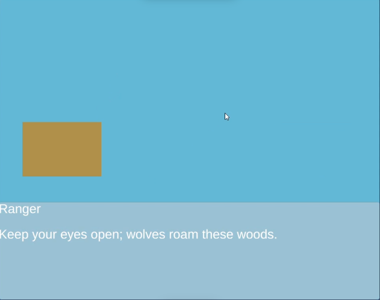

## Unity Dialogue State Machine

| Feature | Details |
|---------|---------|
| **State-pattern core** | `BaseFrameState` + concrete states (`DialogueState`, `TextState`, `OptionState`, `FinalState`) keep logic self-contained and reusable. |
| **Data-driven** | Dialogues are described by a single JSON file (`Stories/story.json`)
| **Assembly Definitions** | Dialogues live in their own asmdef, speeding up compile times and keeping editor code out of player builds. |

| |  |
|----|----|
 |  |
  |  
